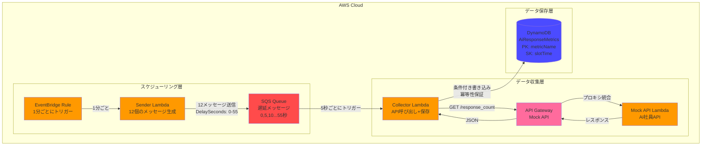

# データ収集スケジューラ アーキテクチャ

## システム構成図

## データフロー図

```mermaid
flowchart LR
    subgraph "毎分0秒"
        A[EventBridge<br/>トリガー]
    end

    subgraph "Sender Lambda処理"
        B[基準時刻取得]
        C[12個の時間幅生成<br/>0-5秒, 5-10秒, ..., 55-60秒]
        D[SQSメッセージ送信<br/>DelaySeconds設定]
    end

    subgraph "5秒ごと"
        E[SQSメッセージ<br/>可視化]
        F[Collector Lambda<br/>起動]
    end

    subgraph "Collector Lambda処理"
        G[メッセージから<br/>from/to取得]
        H[API呼び出し<br/>GET /response_count]
        I[レスポンス<br/>パース]
        J[スロットタイム<br/>計算]
        K[DynamoDB<br/>条件付き書き込み]
    end

    A --> B
    B --> C
    C --> D
    D --> E
    E --> F
    F --> G
    G --> H
    H --> I
    I --> J
    J --> K

    style A fill:#FF9900
    style F fill:#FF9900
    style K fill:#4B4BFF
```

## タイミングチャート

```mermaid
gantt
    title サブミニッツスケジューリング（1分間の動作）
    dateFormat ss
    axisFormat %S秒

    section EventBridge
    トリガー発火           :milestone, m1, 00, 0s

    section Sender Lambda
    12メッセージ生成       :active, s1, 00, 2s

    section SQS Queue
    メッセージ1 (delay=0s)  :crit, q1, 00, 1s
    メッセージ2 (delay=5s)  :crit, q2, 05, 1s
    メッセージ3 (delay=10s) :crit, q3, 10, 1s
    メッセージ4 (delay=15s) :crit, q4, 15, 1s
    メッセージ5 (delay=20s) :crit, q5, 20, 1s
    メッセージ6 (delay=25s) :crit, q6, 25, 1s
    メッセージ7 (delay=30s) :crit, q7, 30, 1s
    メッセージ8 (delay=35s) :crit, q8, 35, 1s
    メッセージ9 (delay=40s) :crit, q9, 40, 1s
    メッセージ10 (delay=45s):crit, q10, 45, 1s
    メッセージ11 (delay=50s):crit, q11, 50, 1s
    メッセージ12 (delay=55s):crit, q12, 55, 1s

    section Collector Lambda
    実行1 (0秒)            :active, c1, 00, 3s
    実行2 (5秒)            :active, c2, 05, 3s
    実行3 (10秒)           :active, c3, 10, 3s
    実行4 (15秒)           :active, c4, 15, 3s
    実行5 (20秒)           :active, c5, 20, 3s
    実行6 (25秒)           :active, c6, 25, 3s
    実行7 (30秒)           :active, c7, 30, 3s
    実行8 (35秒)           :active, c8, 35, 3s
    実行9 (40秒)           :active, c9, 40, 3s
    実行10 (45秒)          :active, c10, 45, 3s
    実行11 (50秒)          :active, c11, 50, 3s
    実行12 (55秒)          :active, c12, 55, 3s
```

## コンポーネント詳細

### EventBridge Rule

- **トリガー**: `rate(1 minute)`
- **ターゲット**: Sender Lambda
- **役割**: 1 分ごとにスケジューリングプロセスを開始

### Sender Lambda

- **ランタイム**: Node.js 20.x
- **メモリ**: 128MB（デフォルト）
- **タイムアウト**: 10 秒
- **環境変数**: `QUEUE_URL`
- **役割**: 12 個の遅延 SQS メッセージを生成

### SQS Queue

- **可視性タイムアウト**: 30 秒
- **メッセージ保持期間**: 1 日
- **遅延設定**: 0, 5, 10, 15, 20, 25, 30, 35, 40, 45, 50, 55 秒
- **役割**: サブミニッツスケジューリングの実現

### Collector Lambda

- **ランタイム**: Node.js 20.x
- **メモリ**: 128MB（デフォルト）
- **タイムアウト**: 30 秒
- **環境変数**:
  - `AI_API_BASE_URL`
  - `AI_METRICS_TABLE_NAME`
- **トリガー**: SQS（バッチサイズ=1）
- **役割**: API 呼び出しと DynamoDB 保存

### API Gateway

- **タイプ**: REST API
- **ステージ**: prod
- **統合**: Lambda プロキシ統合
- **エンドポイント**:
  - `/response_count`
  - `/health`

### Mock API Lambda

- **ランタイム**: Node.js 20.x
- **メモリ**: 128MB（デフォルト）
- **タイムアウト**: 10 秒
- **役割**: AI 社員 API のモック実装

### DynamoDB Table

- **テーブル名**: AiResponseMetrics
- **パーティションキー**: `metricName` (String)
- **ソートキー**: `slotTime` (String)
- **課金モード**: オンデマンド
- **属性**:
  - `metricName`: "ai_response_count"
  - `slotTime`: ISO8601 形式（例: "2025-12-03T10:23:05Z"）
  - `count`: レスポンス数（Number）
