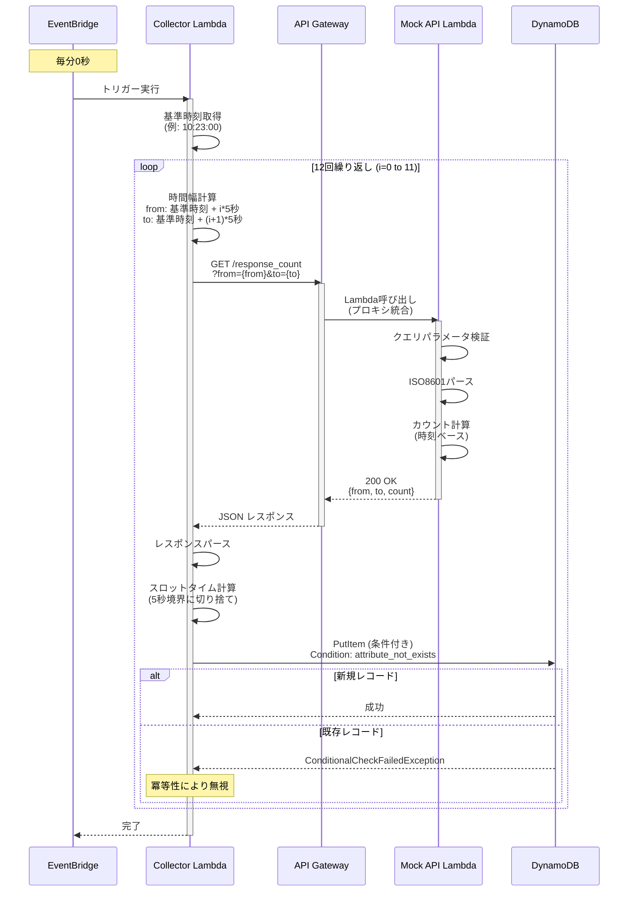
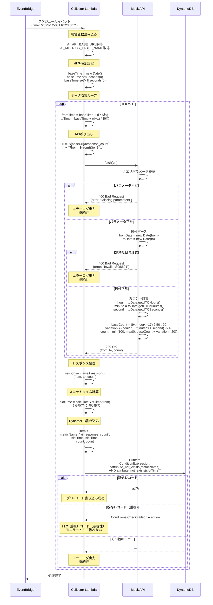
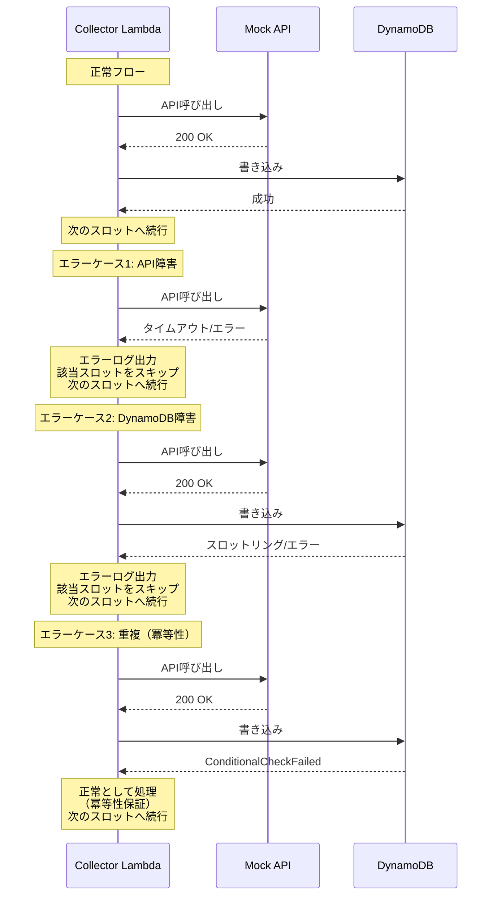
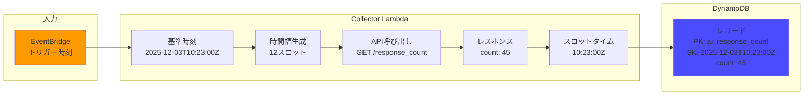
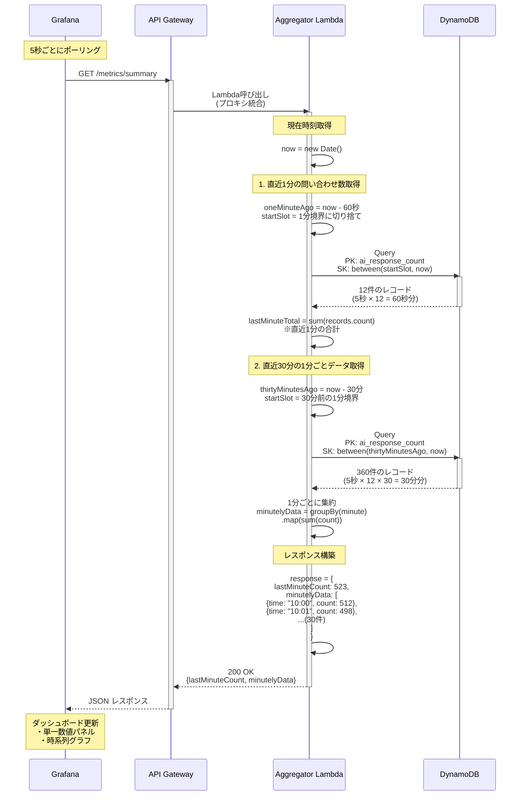
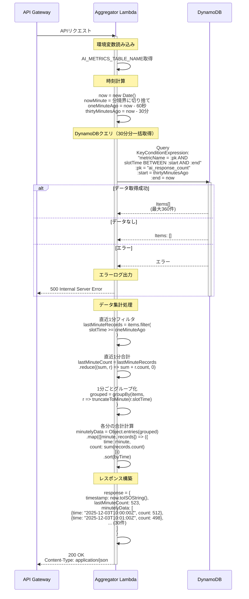
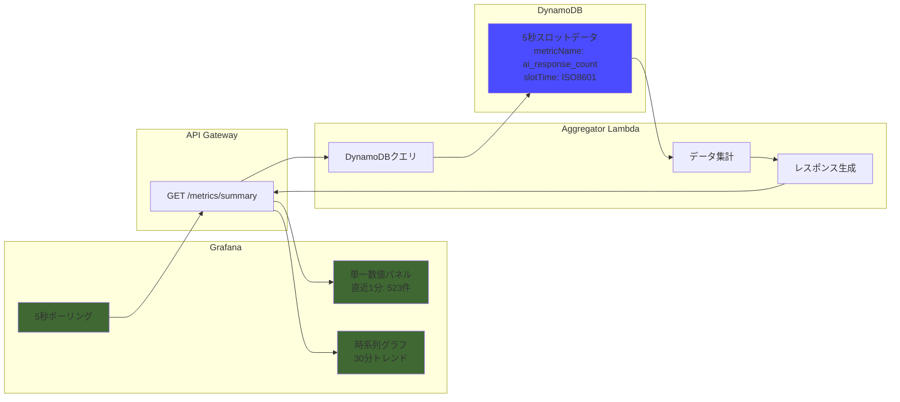

# シーケンス図

## 全体フロー（1 分間のサイクル）



## 詳細シーケンス: Collector Lambda



## エラーハンドリングフロー



## データフロー詳細



## 集計処理フロー（Grafana データ取得）



## 詳細シーケンス: Aggregator Lambda



## Grafana 連携データフロー



## API レスポンス形式

```json
{
  "timestamp": "2025-12-03T10:30:15Z",
  "lastMinuteCount": 523,
  "minutelyData": [
    { "time": "2025-12-03T10:00:00Z", "count": 512 },
    { "time": "2025-12-03T10:01:00Z", "count": 498 },
    { "time": "2025-12-03T10:02:00Z", "count": 534 },
    { "time": "2025-12-03T10:03:00Z", "count": 521 },
    { "time": "2025-12-03T10:04:00Z", "count": 489 },
    { "time": "2025-12-03T10:05:00Z", "count": 545 },
    { "time": "2025-12-03T10:06:00Z", "count": 502 },
    { "time": "2025-12-03T10:07:00Z", "count": 518 },
    { "time": "2025-12-03T10:08:00Z", "count": 531 },
    { "time": "2025-12-03T10:09:00Z", "count": 495 },
    { "time": "2025-12-03T10:10:00Z", "count": 527 },
    { "time": "2025-12-03T10:11:00Z", "count": 509 },
    { "time": "2025-12-03T10:12:00Z", "count": 542 },
    { "time": "2025-12-03T10:13:00Z", "count": 486 },
    { "time": "2025-12-03T10:14:00Z", "count": 553 },
    { "time": "2025-12-03T10:15:00Z", "count": 501 },
    { "time": "2025-12-03T10:16:00Z", "count": 524 },
    { "time": "2025-12-03T10:17:00Z", "count": 538 },
    { "time": "2025-12-03T10:18:00Z", "count": 492 },
    { "time": "2025-12-03T10:19:00Z", "count": 516 },
    { "time": "2025-12-03T10:20:00Z", "count": 529 },
    { "time": "2025-12-03T10:21:00Z", "count": 507 },
    { "time": "2025-12-03T10:22:00Z", "count": 541 },
    { "time": "2025-12-03T10:23:00Z", "count": 483 },
    { "time": "2025-12-03T10:24:00Z", "count": 556 },
    { "time": "2025-12-03T10:25:00Z", "count": 498 },
    { "time": "2025-12-03T10:26:00Z", "count": 522 },
    { "time": "2025-12-03T10:27:00Z", "count": 535 },
    { "time": "2025-12-03T10:28:00Z", "count": 491 },
    { "time": "2025-12-03T10:29:00Z", "count": 523 }
  ]
}
```
