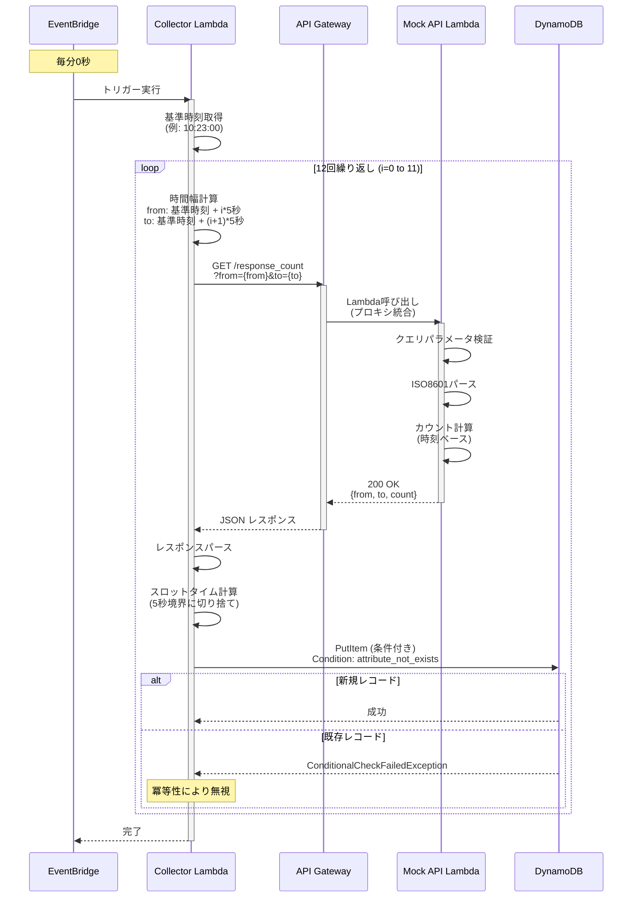
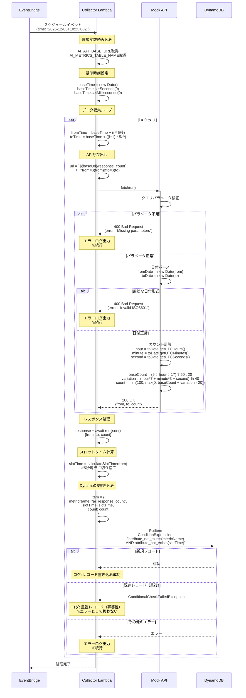
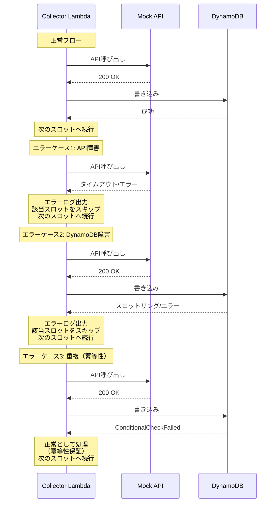
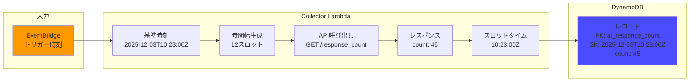

# シーケンス図

## 全体フロー（1 分間のサイクル）

```mermaid
sequenceDiagram
    participant EB as EventBridge
    participant CL as Collector Lambda
    participant API as API Gateway
    participant ML as Mock API Lambda
    participant DDB as DynamoDB

    Note over EB: 毎分0秒
    EB->>CL: トリガー実行

    activate CL
    CL->>CL: 基準時刻取得<br/>(例: 10:23:00)

    loop 12回繰り返し (i=0 to 11)
        CL->>CL: 時間幅計算<br/>from: 基準時刻 + i*5秒<br/>to: 基準時刻 + (i+1)*5秒

        CL->>API: GET /response_count<br/>?from={from}&to={to}

        activate API
        API->>ML: Lambda呼び出し<br/>(プロキシ統合)

        activate ML
        ML->>ML: クエリパラメータ検証
        ML->>ML: ISO8601パース
        ML->>ML: カウント計算<br/>(時刻ベース)
        ML-->>API: 200 OK<br/>{from, to, count}
        deactivate ML

        API-->>CL: JSON レスポンス
        deactivate API

        CL->>CL: レスポンスパース
        CL->>CL: スロットタイム計算<br/>(5秒境界に切り捨て)

        CL->>DDB: PutItem (条件付き)<br/>Condition: attribute_not_exists

        alt 新規レコード
            DDB-->>CL: 成功
        else 既存レコード
            DDB-->>CL: ConditionalCheckFailedException
            Note over CL: 冪等性により無視
        end
    end

    CL-->>EB: 完了
    deactivate CL
```

## 詳細シーケンス: Collector Lambda

```mermaid
sequenceDiagram
    participant EB as EventBridge
    participant CL as Collector Lambda
    participant API as Mock API
    participant DDB as DynamoDB

    EB->>CL: スケジュールイベント<br/>{time: "2025-12-03T10:23:00Z"}

    activate CL
    Note over CL: 環境変数読み込み
    CL->>CL: AI_API_BASE_URL取得<br/>AI_METRICS_TABLE_NAME取得

    Note over CL: 基準時刻設定
    CL->>CL: baseTime = new Date()<br/>baseTime.setSeconds(0)<br/>baseTime.setMilliseconds(0)

    Note over CL: データ収集ループ
    loop i = 0 to 11
        CL->>CL: fromTime = baseTime + (i * 5秒)<br/>toTime = baseTime + ((i+1) * 5秒)

        Note over CL: API呼び出し
        CL->>CL: url = `${baseUrl}/response_count`<br/>+ `?from=${from}&to=${to}`

        CL->>API: fetch(url)

        activate API
        API->>API: クエリパラメータ検証

        alt パラメータ不足
            API-->>CL: 400 Bad Request<br/>{error: "Missing parameters"}
            Note over CL: エラーログ出力<br/>※続行
        else パラメータ正常
            API->>API: 日付パース<br/>fromDate = new Date(from)<br/>toDate = new Date(to)

            alt 無効な日付形式
                API-->>CL: 400 Bad Request<br/>{error: "Invalid ISO8601"}
                Note over CL: エラーログ出力<br/>※続行
            else 日付正常
                API->>API: カウント計算<br/>hour = toDate.getUTCHours()<br/>minute = toDate.getUTCMinutes()<br/>second = toDate.getUTCSeconds()
                API->>API: baseCount = (9<=hour<=17) ? 50 : 20<br/>variation = (hour*7 + minute*3 + second) % 40<br/>count = min(100, max(0, baseCount + variation - 20))

                API-->>CL: 200 OK<br/>{from, to, count}
            end
        end
        deactivate API

        Note over CL: レスポンス処理
        CL->>CL: response = await res.json()<br/>{from, to, count}

        Note over CL: スロットタイム計算
        CL->>CL: slotTime = calculateSlotTime(from)<br/>※5秒境界に切り捨て

        Note over CL: DynamoDB書き込み
        CL->>CL: item = {<br/>  metricName: "ai_response_count",<br/>  slotTime: slotTime,<br/>  count: count<br/>}

        CL->>DDB: PutItem<br/>ConditionExpression:<br/>"attribute_not_exists(metricName)<br/>AND attribute_not_exists(slotTime)"

        alt 新規レコード
            DDB-->>CL: 成功
            Note over CL: ログ: レコード書き込み成功
        else 既存レコード（重複）
            DDB-->>CL: ConditionalCheckFailedException
            Note over CL: ログ: 重複レコード（冪等性）<br/>※エラーとして扱わない
        else その他のエラー
            DDB-->>CL: エラー
            Note over CL: エラーログ出力<br/>※続行
        end
    end

    CL-->>EB: 処理完了
    deactivate CL
```

## エラーハンドリングフロー

```mermaid
sequenceDiagram
    participant CL as Collector Lambda
    participant API as Mock API
    participant DDB as DynamoDB

    Note over CL: 正常フロー
    CL->>API: API呼び出し
    API-->>CL: 200 OK
    CL->>DDB: 書き込み
    DDB-->>CL: 成功
    Note over CL: 次のスロットへ続行

    Note over CL: エラーケース1: API障害
    CL->>API: API呼び出し
    API-->>CL: タイムアウト/エラー
    Note over CL: エラーログ出力<br/>該当スロットをスキップ<br/>次のスロットへ続行

    Note over CL: エラーケース2: DynamoDB障害
    CL->>API: API呼び出し
    API-->>CL: 200 OK
    CL->>DDB: 書き込み
    DDB-->>CL: スロットリング/エラー
    Note over CL: エラーログ出力<br/>該当スロットをスキップ<br/>次のスロットへ続行

    Note over CL: エラーケース3: 重複（冪等性）
    CL->>API: API呼び出し
    API-->>CL: 200 OK
    CL->>DDB: 書き込み
    DDB-->>CL: ConditionalCheckFailed
    Note over CL: 正常として処理<br/>（冪等性保証）<br/>次のスロットへ続行
```

## データフロー詳細

```mermaid
graph LR
    subgraph "入力"
        A[EventBridge<br/>トリガー時刻]
    end

    subgraph "Collector Lambda"
        B[基準時刻<br/>2025-12-03T10:23:00Z]
        C[時間幅生成<br/>12スロット]
        H[API呼び出し<br/>GET /response_count]
        I[レスポンス<br/>count: 45]
        J[スロットタイム<br/>10:23:00Z]
    end

    subgraph "DynamoDB"
        K[レコード<br/>PK: ai_response_count<br/>SK: 2025-12-03T10:23:00Z<br/>count: 45]
    end

    A --> B
    B --> C
    C --> H
    H --> I
    I --> J
    J --> K

    style A fill:#FF9900
    style K fill:#4B4BFF
```
